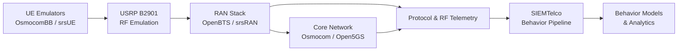

## Architecture Overview

SIEM Telco is built around the principle that **network behavior emerges from the interaction between radio conditions, protocol procedures, and core network logic**.

To preserve this behavior, the architecture explicitly separates:
- **Radio & RF emulation**
- **Radio Access Network (RAN)**
- **Core Network**
- **Behavior analytics (SIEMTelco)**

All components operate inside a **controlled laboratory environment**.

### High-Level Architecture (Visual)




### Architectural Intent
- **UE emulators** generate controlled and repeatable device behavior
- **USRP** preserves real RF characteristics without using public spectrum
- **RAN and Core** follow 3GPP-compliant procedures
- **SIEM Telco** observes and models behavior, not raw packets

No component performs interception, manipulation, or modification of live traffic.


### Containerized Telco Core Simulation (2G–5G)
SIEM Telco provides a **containerized telco-core environment** that mirrors real-world mobile network architecture while remaining **safe, isolated, and research-oriented.**

### Key Principle
> RF behavior is real. Core and analytics are containerized.
Containers are used for **RAN, Core Network, and SIEM,** while **RF is handled by external SDR hardware.**


### Radio Access & RF Emulation (MANDATORY)
### Why RF Emulation Is Mandatory
Mobile network behavior cannot be accurately studied using IP-only simulations.
Radio conditions directly affect:
- attach and detach procedures
- timing advance
- cell reselection
- handover behavior
- signaling stability
  
For this reason, **all transceivers and endpoints in SIEMTelco operate through RF emulation.**

### RF Stack
- SDR Hardware: USRP B2901 (reference platform)
- Driver: UHD (USRP Hardware Driver)
- Environment: Shielded / attenuated lab setup

No over-the-air transmission to public networks is permitted.

### Endpoint (UE) Emulation
Real user devices are intentionally **not used.**
Supported UE emulators:
**OsmocomBB**
- 2G GSM UE behavior
- L1/L2/L3 visibility
**srsUE**
- 4G LTE / 5G NR UE behavior
- NAS and RRC procedure testing

**These endpoints:**
- generate deterministic behavior
- avoid personal data exposure
- support repeatable experiments

### Network Stack Coverage
| Layer     | Technology            | RF Mode   |
| --------- | --------------------- | --------- |
| UE        | OsmocomBB, srsUE      | RF (USRP) |
| RAN       | OpenBTS, srsRAN       | RF (USRP) |
| Core      | Osmocom Core, Open5GS | Container |
| Analytics | SIEMTelco             | Container |

### Repository Structure
```lua
siemtelco/
├── docker/
│   ├── docker-compose.yml
│   ├── ran/
│   │   ├── openbts/
│   │   └── srsran/
│   ├── core/
│   │   ├── osmocom/
│   │   └── open5gs/
│   ├── ue/
│   │   ├── osmocombb/
│   │   └── srsue/
│   └── rf/
│       └── usrp/
├── generators/
├── output/
│   ├── raw_logs/
│   └── behavior_events/
```

### USRP Binding to Docker Containers
To allow RAN containers to access SDR hardware, USRP devices are explicitly bound to Docker.
**Binding Concept**
- UHD runs on the host system
- RAN containers access USRP via USB or network binding
- Containers run in privileged mode for SDR access

### Example (docker-compose snippet)
```yaml
services:
  ran-gsm:
    image: noz/openbts
    privileged: true
    devices:
      - /dev/bus/usb
    volumes:
      - ./rf/usrp:/usrp

  ran-lte:
    image: noz/srsran
    privileged: true
    devices:
      - /dev/bus/usb
```

### This approach ensures:
- realistic RF-driven behavior
- isolation from public networks
- reproducible laboratory experiments


## Safety and Usage Notice
### ⚠️ LAB ENVIRONMENT ONLY
- Use RF shielding and attenuators
- Do not transmit on public spectrum
- Do not connect to live operator networks
- Do not use real subscriber identities

The author and contributors **strongly discourage testing in real networks.**


### Summary
This architecture ensures that:
- Behavior is driven by real RF conditions
- Analysis remains protocol-aligned and compliant
- Privacy and legal boundaries are respected
- Research results are reproducible and defensible
